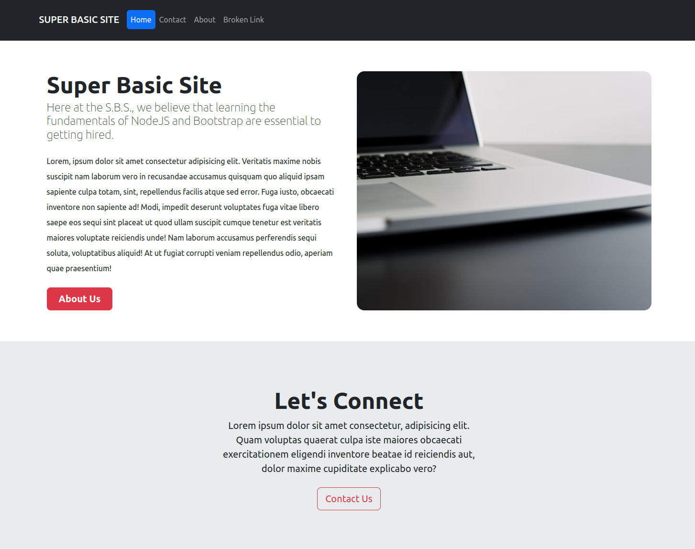

# Odin Project #25: Basic Informational Site (NodeJS & Express)

Welcome to Bryan Miller's Basic Informational Site Project, the [twenty fifth assignment](https://www.theodinproject.com/lessons/nodejs-basic-informational-site) within the Odin Project curriculum. The goal of this repo is to practice the following skill sets:

- NodeJS Fundamentals:
  - `fs`: gives us full access of the file system
  - `path`: helps us work with file paths for requested resources
  - `http`: create web servers that listen for requests & send responses
  - `EventEmitter`: create backend event listeners, allowing us to trigger events
  - custom `modules`: allows us to organize & modularize our code
- Express Fundamentals ([refactored here](https://github.com/bmilcs/odin-basic-informational-site/blob/express_refactor/project/index.js))
  - Middleware Functions
  - `send`
  - `sendFile`
  - Error handling
- npm Packages:
  - `express`: node framework
  - `dotenv`: let's us import environmental variables from `.env` files
  - `nodemon`: automatically restarts the server on file changes
- Bootstrap
- Git Workflows
  - Feature branches
  - Merging

## Links

- [Live Demo](https://replit.com/@bmilcsxreplit/odin-basic-informational-site?v=1)
- [My Odin Project Progress](https://github.com/bmilcs/odin-project)

## Summary

NodeJS is an asynchronous, event driven JavaScript framework that acts as the backend for web applications. The first NodeJS project from the Odin Project calls for a basic http server that serves up an index, contact, about & 404 page. This project presented the perfect opportunity to tackle my first CSS framework (Bootstrap) and refresh my Git workflow skills.

The `main` property in `package.json` points to `projects/index.js`, which is the starting point for this backend web application. Within `index.js`, several npm packages are imported, as well as a custom logging module located in `src/logger.js`.

The logging module exports `myLogger`, an instance of the `EventEmitter` object. The `EventEmitter` object gives us the ability to trigger events using the `emit` method. In this instance, `myLogger` listens for a `log` or `error` event and it logs a message to the console on the backend. To trigger an event, the `.emit()` method is used.

For practice, I created the `http` server using the standard `fs` module to read `html` files from the `html/` directory and then refactored it to use `fs/promises` to get a feel for both syntax styles.

- `fs` methods use callback functions to handle reject/resolve states
- `fs/promises` methods use the `async`/`await` syntax with `try`/`catch` blocks

I've avoided Bootstrap up until this point to force myself to hone my CSS skills. However, this project didn't call for style sheets at all, so I gave Bootstrap a shot. Bootstrap gives us an easy to use, responsive design system for creating UI's. It consists of prebuilt components & CSS classes that we can batch together to quickly build out pages. All in all, it was very easy to adapt with my knowledge of vanilla CSS.

## Screenshots

> Very basic UI using Bootstrap



## Deployment

```sh
# clone repo & change directories
git clone https://github.com/bmilcs/odin-basic-informational-site
cd odin-basic-informational-site

# install all dependencies
npm install

# run app
npm run dev
```
